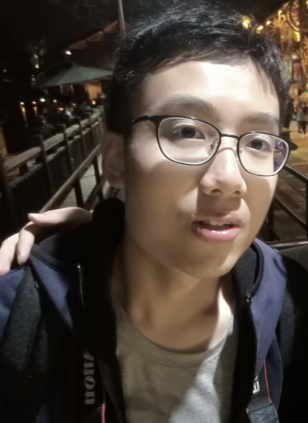
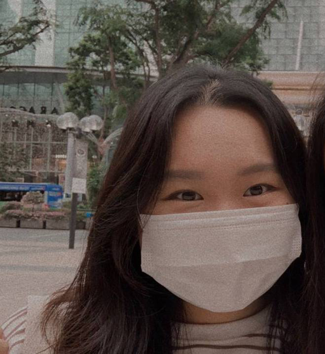
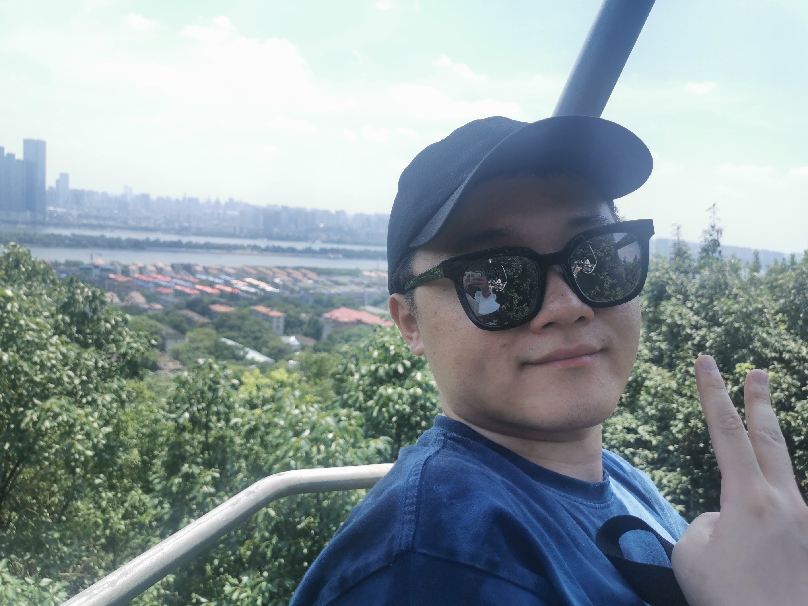

We are a team based in the [School of Computing, National University of Singapore](http://www.comp.nus.edu.sg).

You can reach us at the email `seer[at]comp.nus.edu.sg`

## Project team

### Mo Yunbin

[[github](http://github.com/yunbinmo)]
[[portfolio](team/yunbinmo.md)]

* Role: Integration
* Responsibilities: Appointment

### Koh Su En

[[github](http://github.com/seksek13)]
[[portfolio](team/seksek13.md)]

* Role: Documentation
* Responsibilities: Responsible for the quality of various project documents.

### Jessica Jacelyn

[[github](http://github.com/jessicajacelyn)] [[portfolio](team/jessicajacelyn.md)]

* Role: Developer
* Responsibilities: Deliverables and deadlines + Scheduling and Tracking

### Zheng ZiKang

[[github](http://github.com/zzkzzzz)]
[[portfolio](team/zzkzzzz.md)]

* Role: Developer
* Responsibilities: Testing + Code quality

