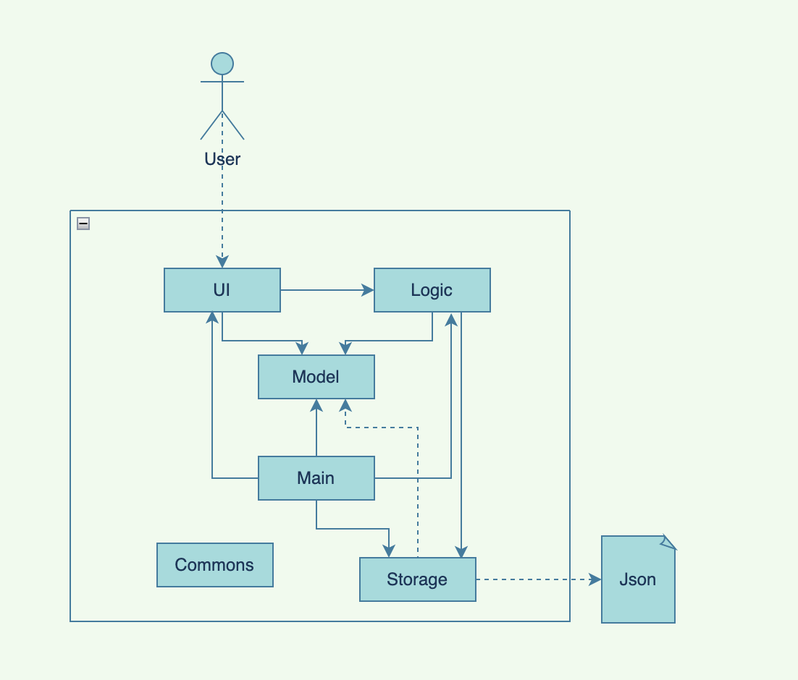
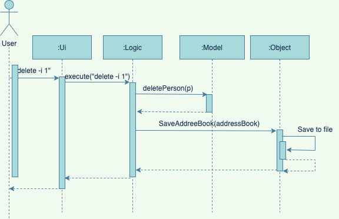
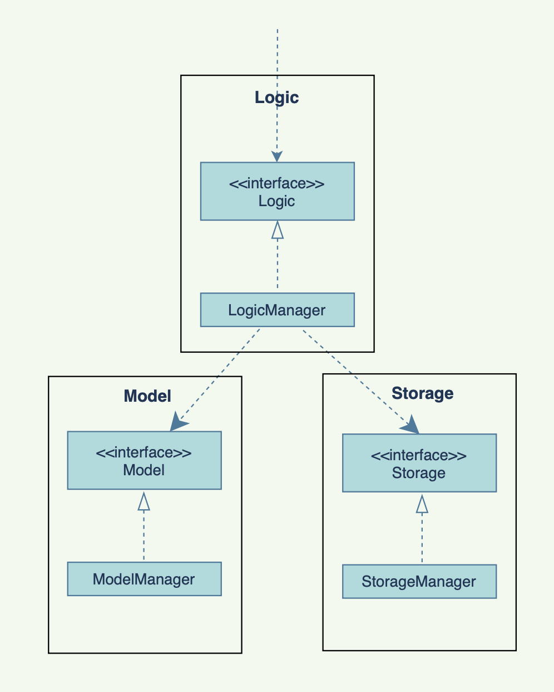
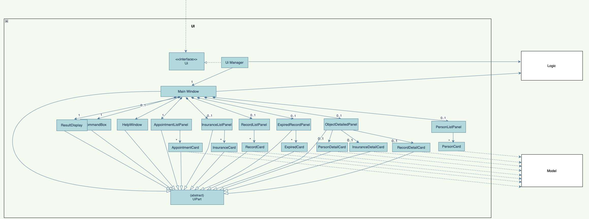
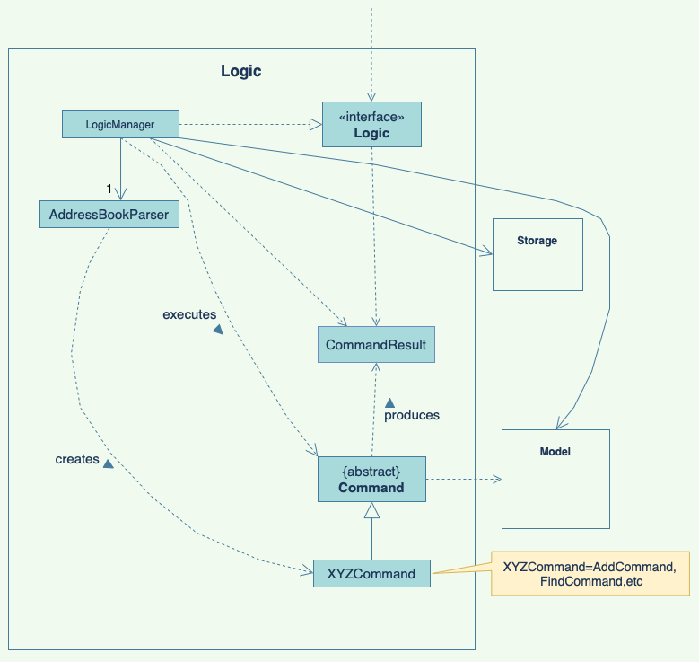
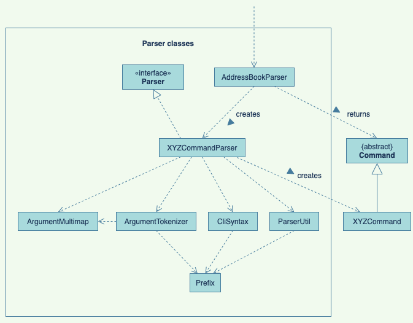
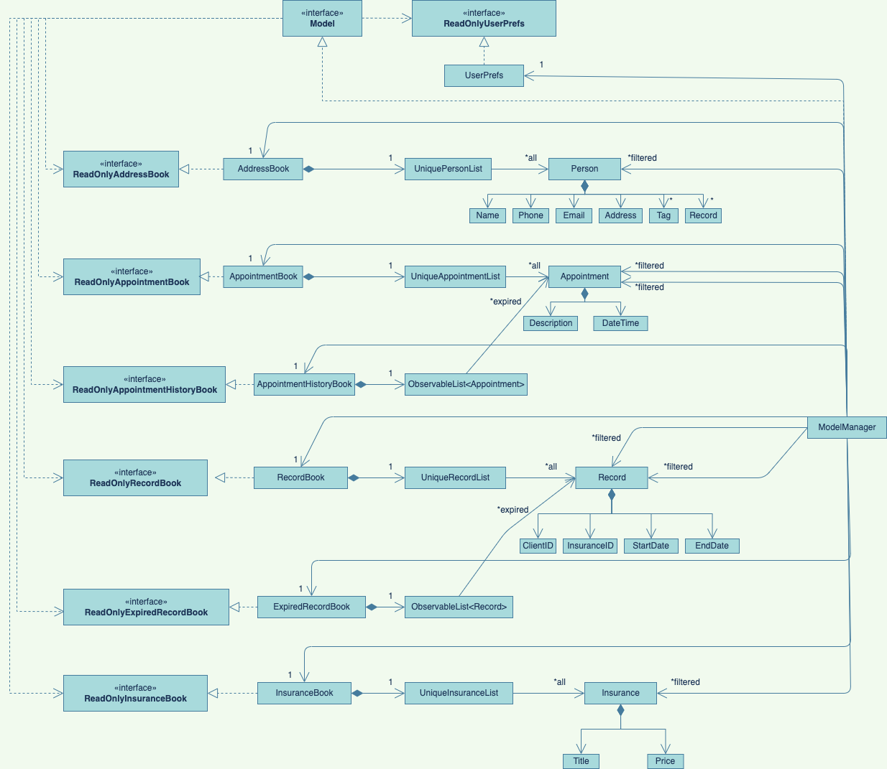
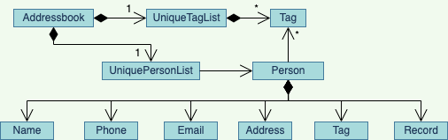
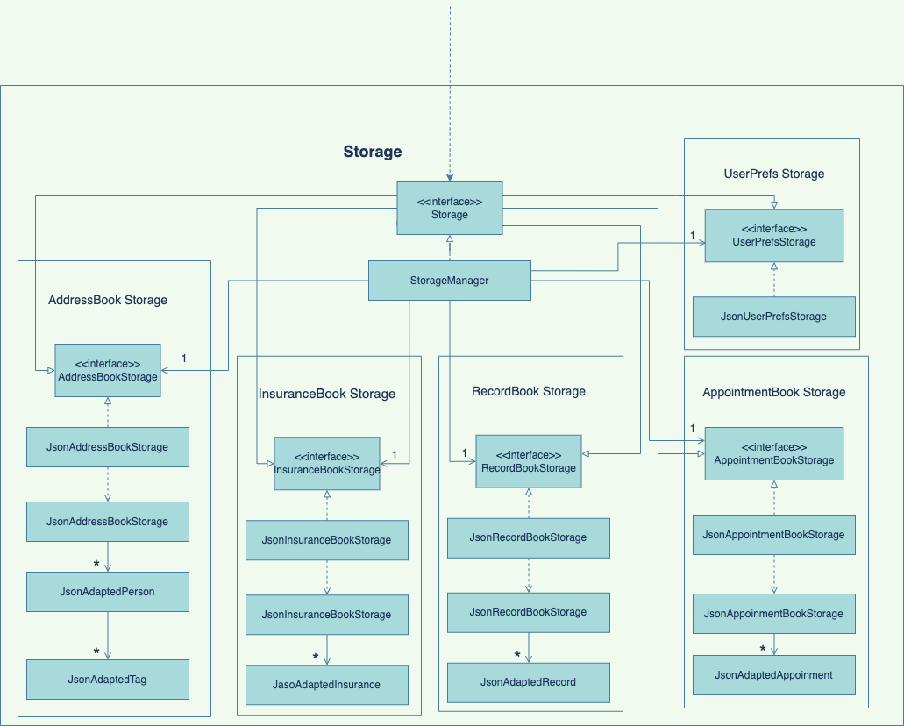
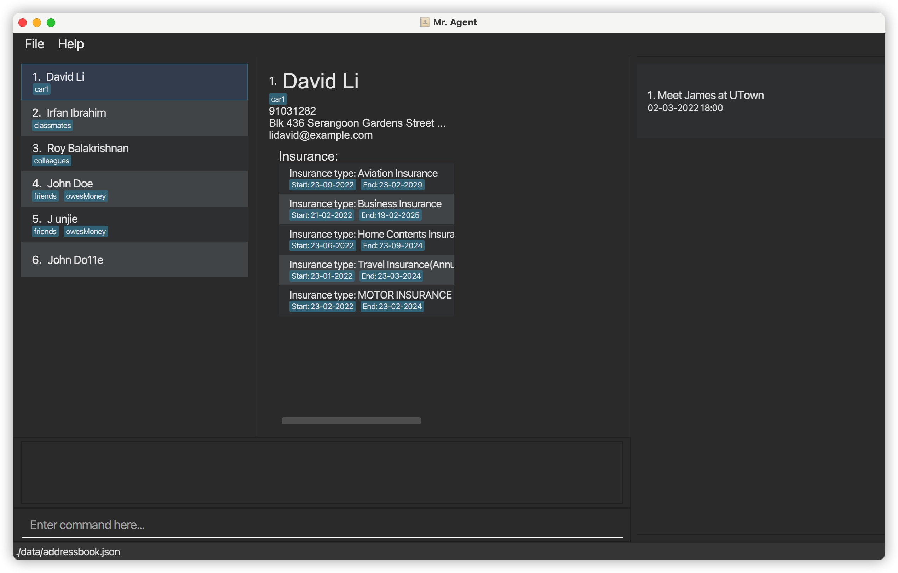

By: Team CS2103-F09-3  (Mo YunBin, Jessica Jacelyn, Koh Su En, Zheng ZiKang)

- [1. Acknowledgements](#Acknowledgements)
- [2. Setting up](#Settingup)
- [3. Design](#Design)
  - [3.1. Architecture](#Architecture)
  - [3.2. UI component](#UI)
  - [3.3. Logic component](#Logic)
  - [3.4. Model component](#Model)
  - [3.5. Storage component](#Storage)
  - [3.6. Common classes](#Common)
- [4. Implementation](#Implementation)
    - [4.1. Sort Records Feature](#SortRecords)
    - [4.2. Sort Appointments Feature](#SortAppointments)
    - [4.3. List history feature](#ListHistory)
    - [4.4. Click event feature](#Click)
    - [4.5. Add Records Feature](#AddRecord)
    - [4.6. Find Appointments Feature](#FindAppointments)
- [5. Documentation](#Documentation)
- [Appendix A: Product Scope](#scope)
- [Appendix B: User Stories](#userStories)
- [Appendix C: Use Cases](#usecases)
- [Appendix D: Non Functional Requirements](#Non-Functional)
- [Appendix E: Glossary](#Glossary)
- [Appendix F: Instructions for Manual Testing](#manual)
- [Appendix G: Effort](#effort)

--------------------------------------------------------------------------------------------------------------------

## **1. Acknowledgements**

* This project is based on the [se-edu/addressbook-level3](https://github.com/se-edu/addressbook-level3) created by the [SE-EDU initiative](https://se-education.org/).
* The following libraries were also used in the Mr.Agent.
  * [JavaFX](https://openjfx.io/) for the Graphical User Interface.
  * [Jackson](https://github.com/FasterXML/jackson) for data-processing.
  * [JUnit5](https://github.com/junit-team/junit5) for Testing.

--------------------------------------------------------------------------------------------------------------------

## **2. Setting up, getting started**

Refer to the guide [_Setting up and getting started_](SettingUp.md).

--------------------------------------------------------------------------------------------------------------------

## **3. Design**

### 3.1. Architecture

The ***Architecture Diagram*** given above explains the high-level design of the App.

Given below is a quick overview of main components and how they interact with each other.

**Main components of the architecture**

**`Main`** has two classes called [`Main`](https://github.com/AY2122S2-CS2103-F09-3/tp/blob/master/src/main/java/seedu/address/Main.java) and [`MainApp`](https://github.com/AY2122S2-CS2103-F09-3/tp/blob/master/src/main/java/seedu/address/MainApp.java). It is responsible for,
* At app launch: Initializes the components in the correct sequence, and connects them up with each other.
* At shut down: Shuts down the components and invokes cleanup methods where necessary.

[**`Commons`**](#common-classes) represents a collection of classes used by multiple other components.

The rest of the App consists of four components.

* [**`UI`**](#UI): The UI of the App.
* [**`Logic`**](#Logic): The command executor.
* [**`Model`**](#Model): Holds the data of the App in memory.
* [**`Storage`**](#Storage): Reads data from, and writes data to, the hard disk.

**How the architecture components interact with each other**

The *Sequence Diagram* below shows how the components interact with each other for the scenario where the user issues the command `delete -c 1`.

Each of the four main components (also shown in the diagram above),

* Defines its *API* in an `interface` with the same name as the Component.
* Implements its functionality using a concrete `{Component Name}Manager` class (which follows the corresponding API `interface` mentioned in the previous point).

For example, the `Logic` component defines its API in the `Logic.java` interface and implements its functionality using the `LogicManager.java` class which follows the `Logic` interface. Other components interact with a given component through its interface rather than the concrete class (reason: to prevent outside component's being coupled to the implementation of a component), as illustrated in the (partial) class diagram below.

The sections below give more details of each component.

### 3.2. UI component

The **API** of this component is specified in [`Ui.java`](https://github.com/AY2122S2-CS2103-F09-3/tp/blob/master/src/main/java/seedu/address/ui/Ui.java)

The UI consists of a `MainWindow` that is made up of parts e.g.`CommandBox`, `ResultDisplay`, `PersonListPanel`, `AppointmentListPanel`, `InsuranceListPanel`, `RecordListPanel`, `ExpiredRecordPanel`, `ObejctDetailedPanel` etc. All these, including the `MainWindow`, inherit from the abstract `UiPart` class which captures the commonalities between classes that represent parts of the visible GUI.

The `UI` component uses the JavaFx UI framework. The layout of these UI parts are defined in matching `.fxml` files that are in the `src/main/resources/view` folder. For example, the layout of the [`MainWindow`](https://github.com/AY2122S2-CS2103-F09-3/tp/blob/master/src/main/java/seedu/address/ui/MainWindow.java) is specified in [`MainWindow.fxml`](https://github.com/AY2122S2-CS2103-F09-3/tp/blob/master/src/main/resources/view/MainWindow.fxml)

The `UI` component,

* Executes user commands using the `Logic` component.
* Listens for changes to `Model` data so that the UI can be updated with the modified data.
* Keeps a reference to the `Logic` component, because the `UI` relies on the `Logic` to execute commands.
* Depends on some classes in the `Model` component, as it displays `Person` object residing in the `Model`.
* Does not replace the right panel - `AppointmentListPanel` at any time.
* Based on the user commands, left panel changes accordingly. e.g. when `list -r` is entered, `RecordListPanel` will replace the existing panel.
* Listens for user click on `PersonListPanel` and will update the `ObjectDetailedPanel` to show respective client's information.

### 3.3. Logic component

**API** : [`Logic.java`](https://github.com/AY2122S2-CS2103-F09-3/tp/blob/master/src/main/java/seedu/address/logic/Logic.java)

Here's a (partial) class diagram of the `Logic` component:

How the `Logic` component works:
1. When `Logic` is called upon to execute a command, it uses the `AddressBookParser` class to parse the user command.
1. This results in a `Command` object (more precisely, an object of one of its subclasses e.g., `AddCommand`) which is executed by the `LogicManager`.
1. The command can communicate with the `Model` when it is executed (e.g. to add a client).
1. The result of the command execution is encapsulated as a `CommandResult` object which is returned from `Logic`.

The Sequence Diagram below illustrates the interactions within the `Logic` component for the `execute("delete -c 1")` API call.

:information_source: **Note:** The lifeline for `DeleteCommandParser` should end at the destroy marker (X) but due to a limitation of PlantUML, the lifeline reaches the end of diagram.

Here are the other classes in `Logic` (omitted from the class diagram above) that are used for parsing a user command:

How the parsing works:
* When called upon to parse a user command, the `AddressBookParser` class creates an `XYZCommandParser` (`XYZ` is a placeholder for the specific command name e.g., `AddCommandParser`) which uses the other classes shown above to parse the user command and create a `XYZCommand` object (e.g., `AddCommand`) which the `AddressBookParser` returns back as a `Command` object.
* All `XYZCommandParser` classes (e.g., `AddCommandParser`, `DeleteCommandParser`, ...) inherit from the `Parser` interface so that they can be treated similarly where possible e.g, during testing.

### 3.4. Model component
**API** : [`Model.java`](https://github.com/AY2122S2-CS2103-F09-3/tp/blob/master/src/main/java/seedu/address/model/Model.java)

The `Model` component,
* stores different kinds of  address book data i.e., all `Person`, `Appointment`, `Record`, and `Insurance` objects (which are contained in an `UniquePersonList`, an `UniqueAppointmentList`, an `UniqueRecordList` and an `UniqueInsuranceList` respectively).
* for example, stores the currently 'selected' `Person` objects (e.g., results of a search query) as a separate _filtered_ list which is exposed to outsiders as an unmodifiable `ObservableList<Person>` that can be 'observed' e.g. the UI can be bound to this list so that the UI automatically updates when the data in the list change. The same mechanism applies to `Appointment`, `Record`, and `Insurance` objects as well.
* stores a `UserPref` object that represents the user’s preferences. This is exposed to the outside as a `ReadOnlyUserPref` objects.
* does not depend on any of the other three components (as the `Model` represents data entities of the domain, they should make sense on their own without depending on other components)

:information_source: **Note:** An alternative (arguably, a more OOP) model (containing `Person` object only for simplicity) is given below. It has a `Tag` list in the `AddressBook`, which `Person` references. This allows `AddressBook` to only require one `Tag` object per unique tag, instead of each `Person` needing their own `Tag` objects. 

### 3.5. Storage component

**API** : [`Storage.java`](https://github.com/AY2122S2-CS2103-F09-3/tp/blob/master/src/main/java/seedu/address/storage/Storage.java)

The `Storage` component,

* can save address book data, insurance book data, record book data, appointment book data and user preference data in json format, and read them back into corresponding objects.
* inherits from both `AddressBookStorage`, `InsuranceBookStorage`, `RecordBookStorage`, `AppointmentBookStorage` and `UserPrefStorage`, which means it can be treated as either one (if only the functionality of only one is needed).
* depends on some classes in the `Model` component (because the `Storage` component's job is to save/retrieve objects that belong to the `Model`)
* note that for history related features will only read from existing storage and will not create new json file. For example, list expired record command will search in RecordBookStorage to find expired records.

### 3.6. Common classes

Classes used by multiple components are in the `seedu.addressbook.commons` package.

--------------------------------------------------------------------------------------------------------------------

## **4. Implementation**

This section describes some noteworthy details on how certain features are implemented.

### 4.1. Sort Records Feature

#### Implementation

The Sort Records Feature is facilitated by `SortRecordCommand`. It extends `Command` with its own execution logic. It supports the following commands:

* `sort -r sa` — Sort the records by start date in ascending order.
* `sort -r sd` — Sort the records by start date in descending order.
* `sort -r ea` — Sort the records by end date in ascending order.
* `sort -r ed` — Sort the records by end date in descending order.

These commands will be parsed by the `AddressBookParser` and `SortReocrdCommandPasrser`. `ModelManger` will override `sortRecordBook()` from `Model` which take in an `Comparator<Record>` object as input. Then `ReocrdBook` will sort the `UniqueRecordList` base on the Comparator given.

Given below is an example usage scenario and how the Sort Records Command behaves at each step.

Step 1. The user launches the application and executes `sort -r sa` command to sort the records by start date in ascending order.

Step 2. The `LogicManager` receives the input from `UI#MainWindow` and calls `AddressBookParser#parseCommand()`, causing the user input being parsed and an object of `SortRecordCommand` returns.

Step 3. `LogicManager` executes object of `SortRecordCommand`. `SortRecordCommand` will invoke `ModelManager#sortRecordBook()` with different Comparator base on user input.

Step 4. `ModelManger` will invoke `RecordBook#sortRecord()` with the comparator as input to sort the `UniqueRecordList`.

Step 5. `MainWindow` will update the `RecordListPanel` with sorted `ObservableList` of records.

#### Design considerations

**Aspect: How sort records stored:**

* **Alternative 1 (current choice):** Saves the sorted records to RecordBook.
  * Pros: Easy to implement.
  * Cons: The original order of record list is not preserved.

* **Alternative 2:** Creates a temporary sorted records List.
  * Pros: The original order of record list is preserved.
  * Cons:  May have performance issues in terms of memory usage.

### 4.2. Sort Appointments Feature

#### Implementation

The Sort Appointments Feature is facilitated by `SortAppointmentCommand`. It extends `Command` with it own execution logic. It supports the following commands:

* `sort -a a` — Sort the appointments by appointment time in ascending order.
* `sort -a d` — Sort the appointments by appointment time in descending order.

These commands will be parsed by the `AddressBookParser` and `SortAppointmentCommandPasrser`. `ModelManger` will override `sortAppointmentBook()` from `Model` which takes in an `Comparator<Appointment>` object as input. Then `AppointmentBook` will sort the `UniqueAppointmentList` base on the Comparator given.

Given below is an example usage scenario and how the Sort Appointments Command behaves at each step.

Step 1. The user launches the application and executes `sort -a a` command to sort the appointments by time in ascending order.

Step 2. The `LogicManager` receives the input from `UI#MainWindow` and calls `AddressBookParser#parseCommand()`, causing the user input being parsed and an object of `SortAppointmentCommand` returns.

Step 3. `LogicManager` executes object of `SortAppointmentCommand`. `SortAppointmentCommand` will invoke `ModelManager#sortAppointmentBook()` with the stated Comparator base on user input.

Step 4. `ModelManger` will invoke `AppointmentBook#sortAppointment()` with the comparator as input to sort the `UniqueAppointmentList`.

Step 5. `MainWindow` will update the `AppointmentListPanel` with sorted `ObservableList` of appointments.

#### Design considerations

**Aspect: What is a good sorting order to use:**

* **Alternative 1 (current choice):** Sorts solely based on appointment date and time.
    * Pros: Makes more sense for the target user as appointments are time-sensitive.
    * Cons: Users have limited option of sorting order.

* **Alternative 2:** Sorting options for each attribute of appointment.
    * Pros: More flexible sorting options.
    * Cons:  Sorting by other attributes might not be useful and not even used frequently.

Moreover, design considerations for sort record command also apply here.

### 4.3. List history feature

#### Implementation
There are 2 commands in the history features, one for listing appointment history and one for expired records:
The feature is facilitated by:
* `ListAppointmentHistoryCommand` which extends `Command`, for listing appointment history. 
The command format is `list -h`.
* `ListExpiredRecordsCommand` which extends `Command`, for listing expired records. The command format is `list -e`.

Given below is an example usage scenario and how the list appointment history command behaves at each step.

Step 1. The user launches the application and executes `list -h` command to list the appointment history.

Step 2. The `LogicManager` receives the input from `UI#MainWindow` and calls `AddressBookParser#parseCommand()`, causing the user input being parsed and an object of `ListAppointmentHistoryCommand` returns.

Step 3. `LogicManager` executes object of `ListAppointmentHistoryCommand`. `ListAppointmentHistoryCommand` will invoke `ModelManager#getAppointmentHistoryBook()`.

Step 4. `ModelManger` will invoke `AppointmentHistoryBook#getAppointmentHistoryList()`.

Step 5. `MainWindow` will update the `AppointmentListPanel` with appointment histories.

#### Design considerations

**Aspect: How to store the appointment history data:**

* **Alternative 1 (current choice):** Creates a temporary appointment history list.
    * Pros: Saves storage.
    * Cons: Harder to implement as separate methods has to be created to check passed appointments everytime the application is launched.

* **Alternative 2:** Saves the appointment history to a separate json file.
    * Pros: Easier to implement.
    * Cons: Code is longer and harder to maintain.

**Note**: how list expired records behaves and its design considerations are the same as list appointment history

### 4.4. Click event feature

#### Implementation

The `objectListPanel` will be updated according to user command. It supports the following commands:

* `list -c` — List all clients.
* `list -i` — List all insurances.
* `list -r` — List all records.
* `list -e` — List all expired records.
* `list -h` — List all passed appointments.
  
The content in `detailPane` will be updated with details of the object base on the click event.

Step 1. The user launches the application and executes `list -c` command to list all clients.

Step 2.  Then `personListPanel` (filled by `ObservableList` of client) will be added into `objectListPanel` as children component.

Step 3. User click on `Davia Li`, then `PersonDetailCard` (filled by the detail information of `Davia Li`) will be added into `detailPanel` as children component.

#### Design considerations

**Aspect: How to arrange all components:**

* **Alternative 1 (current choice):** Update the panel base on command and click event.
  * Pros:
      1. The UI looks more clean and clear.
      2. The cells of `objectListPanel` only contains important information like client name and tags.
  * Cons: User needs to click on certain cell to look into details.

* **Alternative 2:** Display everything with details(client and records information) in the `objectListPanel`.
  * Pros: User does not need to click to look into details.
  * Cons: All information are squeezed together and the list can only contain a maximum of 3-5 cells.
  User needs to scroll down to check other items in the list.

### 4.5. Add Records Feature

#### Implementation

The Add Records Feature will be facilitated by `AddRecordCommand` which implements `Parser` and `AddCommand` which extends `Command`. 

The command format is `add -r c/ClientIndex i/InsuranceIndex sd/StartDate ed/EndDate` - add a record to the client at `ClientIndex` with insurance of `InsuranceIndex` valid from `StartDate` to `EndDate`

The relevant methods are:

1. `AddCommandParser#parse(List<Person> personList, ObservableList<Insurance> insuranceList,
   String args)` --> Parse the relevant detailed information 
   
2. `AddCommand#execute(Model model)` --> Checks for duplication , validate each information and store to library

Given below is an example usage scenario and how the AddCommand behaves at each step.

Step1. The user launches the application and executes `add -r c/1 i/1 sd/22-03-2022 ed/ 22-03-2032`

Step2. The `LogicManager` receives the input from `UI#MainWindow` and calls `AddressBookParser#parseCommand()`, 
and determine that it is an Add Command.

Step3. AddCommandParser would check if the `ClientIndex` and `InsuranceIndex` exist in the library. Then it will continue to check if the `StartDate` is before the `EndDate`

Step4. Execution of Add would take place and the result will be updated in the filtered record list Model.

Important Features to take note:

1. The `add record` command takes in the `ClientIndex` and `InsuranceIndex` but stores the Client's `Name` and Insurance's `Title` in the RecordBook.
2. The `sd/STARTDATE` entered must strictly be before the `sd/ENDDATE`, else `ParseException` will be thrown

#### Design considerations

**Aspect: How to add record to recordBook:**

* **Alternative 1 (current choice):** User inputs all required information at once
    * Pros:
        1. Faster response rate as system does not need to prompt and wait for the user to key in the information needed.
        2. Users, who are fast-typers, can enter information at once, increasing efficiency.
    * Cons: More prone to typo errors.

* **Alternative 2:** System prompts and user input information one at a time
    * Pros: Easier for user to view their input, reducing typing errors.
    * Cons: Less responsive as user needs to wait for the system to validate the information entered one at a time before prompting the user to key in the next information.

### 4.6. Find Appointments Feature

#### Implementation

The Find Appointments Feature will be facilitated by `FindAppointmentCommand` which extends `Command` with its own execution logic, the following command is supported:
* find -a KEYWORD [MORE_KEYWORDS]

This command will be parsed by the `AddressBookParser` and then handled by the `FindAppointmentCommandParser`, which then returns an executable FindAppointmentCommand if the input is valid.

Given below is an example usage scenario and how the `FindAppointmentCommand` is processed at each step.

Step 1. The user launches the application and executes `find -a Bugis`

Step 2. The LogicManager receives the input from `UI#MainWindow` and calls `AddressBookParser#parseCommand()`, and determines that it is a command related to `Appointment`.

Step 3. The inputs are directed to `AddressBookParser#parseAppointmentCommand` where the `FindAppointmentCommandParser` is invoked.

Step 4. A `FindAppointmentCommand` object is returned to `LogicManager`, it then gets executed where `ModelManager` will update the `filteredAppointmentList` using the keyword.

Step 5. `MainWindow` will update the `AppointmentListPanel` to show the appointments whose description contains the keyword.

#### Design considerations

**Aspect: How to filter the appointment list:**

* **Alternative 1 (current choice):** Finds appointments by keyword
    * Pros: The filtered result tends to be more relevant.
    * Cons: User must enter the keyword correctly and completely to locate the desired appointments (partial words would not be matched).

* **Alternative 2:** Finds appointment by partial/complete keyword or date and time
    * Pros: More friendly to use when user cannot remember the full search term to use.
    * Cons: 
      * Filtering by date and time does not add much value since `sort -a` command already exists.
      * User might get less relevant filtered result.

--------------------------------------------------------------------------------------------------------------------

## **5. Documentation, logging, testing, configuration, dev-ops**

* [Documentation guide](Documentation.md)
* [Testing guide](Testing.md)
* [Logging guide](Logging.md)
* [Configuration guide](Configuration.md)
* [DevOps guide](DevOps.md)

--------------------------------------------------------------------------------------------------------------------

## **Appendix: Requirements**

### Product scope

**Target user profile**:

* has a need to manage a significant number of clients
* has a need to manage and schedule numerous appointments
* prefer desktop apps over other types
* prefers typing to mouse interactions
* is reasonably comfortable using CLI apps

**Value proposition**: manage clients, insurances, records and appointments faster than a typical mouse/GUI driven app

### User stories

Priorities: High (must have) - `* * *`, Medium (nice to have) - `* *`, Low (unlikely to have) - `*`

| Priority | As a …​                                        | I want to …​                  | So that I can…​                                                        |
|----------|------------------------------------------------|-------------------------------|------------------------------------------------------------------------|
| `* * *`  | new user                                       | see usage instructions        | refer to instructions when I forget how to use the App                 |
| `* * *`  | insurance agent                                | add a new client              | manage clients in the application                                      |
| `* * *`  | insurance agent                                | delete a client               | remove entries that I no longer need                                   |
| `* * *`  | insurance agent                                | find a client by name         | locate details of clients without having to go through the entire list |
| `* * *`  | insurance agent                                | list all clients              | view clients that are in my contact                                    |
| `* * *`  | insurance agent                                | add an insurance              | manage all insurances in the apllication                               |
| `* * *`  | insurance agent                                | edit an insurance             | make changes to insurance saved in the application                     |
| `* * *`  | insurance agent                                | list all insurances            | view all that I have stored in the application                         |
| `* * *`  | insurance agent                                | delete an insurance           | remove entries that I no longer need                           |
| `* * *`  | insurance agent                                | find insurances by title            | locate insurances without having to go through the entire list                         |
| `* * *`  | insurance agent                                    | add a record to client        | keep a record of the insurances that the client have                   |
| `* * *`  | insurance agent                                | delete a record               | remove entries that I no longer need                                   |
| `* * *`  | insurance agent                                | edit a record                 | make changes to record saved in the application                        |
| `* * *`  | insurance agent                                | list all records              | view records that are I have with my clients                                    |
| `*`      | insurance agent want to check records     | sort record by start/end date | locate almost expired/newest records easily                            |
| `* * *`    | insurance agent frequently having appointments | view all appointments         | be reminded of all the meetings I have with my clients                 |
| `* * *`    | insurance agent frequently having appointments | add new appointments          | note down any future meetings I have with my client                    |
| `* * *`    | insurance agent frequently having appointments | delete an appointment         | get rid of any canceled/completed appointments to avoid confusion      |
| `* * *`    | insurance agent frequently having appointments | edit an appointment           | amend appointment details to suit clients' needs                       |
| `* * *`    | insurance agent frequently having appointments | find an appointment           | quickly locate a related appointment                                   |
| `* * *`    | insurance agent frequently having appointments | sort appointments             | prioritize more urgent appointments                                    |
| `* * *`    | insurance agent frequently having appointments | clear all appointments             | have cleaner view of appointments after a long time                                    |
| `* * *`  | insurance agent                                | view passed appointments      | know account my meetups with my clients                                |
| `* * *`  | insurance agent                                | view expired records          | refer to passed records in case clients want to know/renew insurance   |

### Use cases

(For all use cases below, the **System** is the `Mr Agent` and the **Actor** is the `user`, unless specified otherwise. The other functionalities, including `Insurance`, `Record`, `Appointment` follow similar flows as client, therefore, the related use cases are omitted here.)

**Use case: Add a client**

**MSS**
1. User enters command and arguments to add new client.
2. Mr Agent shows success message for adding client.

**Extensions**
* 2a. The argument(s) are incomplete.

    * 2a1. Mr Agent shows an error message.

      Use case resumes at step 1.

**Use case: Edit a client**

**MSS**

1.  User requests to list clients.
2.  Mr Agent shows a list of clients.
3.  User requests to edit a specific client by index in the list and enters requested details.
4.  Mr Agent updates the client.

    Use case ends.

**Extensions**

* 2a. The list is empty.

  Use case ends.

* 3a. The given index is invalid.

    * 3a1. Mr Agent shows an error message.

      Use case resumes at step 2.
      
* 3b. Mr Agent detects an error in the entered data.

    * 3a1. Mr Agent shows an error message.

      Use case resumes at step 3.
    
**Use case: List a client**

**MSS**

1.  User requests to list clients
2.  Mr Agent shows a list of clients

    Use case ends.

**Extensions**

* 2a. The list is empty.

  Use case ends.

**Use case: Delete a client**

**MSS**

1.  User requests to list clients
2.  Mr Agent shows a list of clients
3.  User requests to delete a specific client by index in the list
4.  Mr Agent deletes the client

    Use case ends.

**Extensions**

* 2a. The list is empty.

  Use case ends.

* 3a. The given index is invalid.

    * 3a1. Mr Agent shows an error message.

      Use case resumes at step 2.

**Use case: Sort appointments**

**MSS**
1. User enters command and arguments to sort appointments ascendingly.
2. Mr Agent shows success message for sorting appointments.

**Extensions**
* 1a. The argument(s) are incomplete.

    * 1a1. Mr Agent shows an error message and correct command usage.

      Use case resumes at step 1.
    

### Non-Functional Requirements

1. Should work on any _mainstream OS_ as long as it has Java `11` or above installed.
2. Should be able to hold up to 1000 clients without a noticeable sluggishness in performance for typical usage.
3. A user with above average typing speed for regular English text (i.e. not code, not system admin commands) should be able to accomplish most of the tasks faster using commands than using the mouse.
4. No network connection needed.
5. The source code should be open source.
6. The user interface should be intuitive enough for users who are not IT-savvy.

### Glossary

* **Appointment:** To-dos created by user, with description, data and time specified.
* **Appointment History:** Appointments that have passed (before the current time).
* **Client**: Contacts that needs to be managed by user.
* **Expired Record:** Records that have passed its end date.
* **Insurance category:** Types of insurance, e.g. health, financial, life.
* **Insurance code:** Unique IDs attached to each insurance.
* **Mainstream OS**: Windows, Linux, Unix, OS-X.
* **Record:** Record of insurance that is bought by a client, i.e. when a client purchase an insurance, a new record will be created and saved in the database with the client and insurance's IDs. Each record is unique.

--------------------------------------------------------------------------------------------------------------------

## Instructions for manual testing

Given below are instructions to test the app manually.

:information_source: **Note:** These instructions only provide a starting point for testers to work on;
testers are expected to do more *exploratory* testing.

### Launch and shutdown

1. Initial launch

   1. Download the jar file and copy into an empty folder

   1. Double-click the jar file Expected: Shows the GUI with a set of sample contacts. The window size may not be optimum.

1. Saving window preferences

   1. Resize the window to an optimum size. Move the window to a different location. Close the window.

   1. Re-launch the app by double-clicking the jar file. 
       Expected: The most recent window size and location is retained.
      

### Adding a client

1. Adding a client 

    1. Test case: `add -c n/James Ho p/12345678 e/jamesho@example.com a/nus-pgp ` 
       Expected: Client named James Ho with phone number 2345678, email account at jamesho@example.com and address of nus-pgp is addded to the list. Details of the added client shown in the status message and on the detailPane

    1. Test case: `add -c p/12345678 e/jamesho@example.com a/nus-pgp` 
       Expected: No client is added. Error details shown in the status message.

    1. Other incorrect delete commands to try: `add -c`, `add -c n/` 
       Expected: Similar to previous.
       
### Deleting a client

1. Deleting a client while all clients are being shown

   1. Prerequisites: List all clients using the `list -c` command. Multiple clients in the list.

   1. Test case: `delete -c 1` 
      Expected: First client is deleted from the list. Details of the deleted contact shown in the status message. Timestamp in the status bar is updated.

   1. Test case: `delete -c 0` 
      Expected: No client is deleted. Error details shown in the status message. Status bar remains the same.

   1. Other incorrect delete commands to try: `delete -c`, `delete -c x`, `...` (where x is larger than the list size) 
      Expected: Similar to previous.
      
### Editing a client

1. Editing a client while all clients are being shown

    1. Prerequisites: List all clients using the `list -c` command. Multiple clients in the list.
    
    1. Test case: `edit -c 6 n/James Lee e/jameslee@example.com` 
       Expected: Sixth client's details is edited, name will be changeed to James Lee, email address changed to jameslee@example.com. Details of the edited client shown in the status message and on the detailPane

    1. Test case: `edit -c p/12345678 e/jamesho@example.com a/nus-pgp` 
       Expected: No client is edited. Error details shown in the status message.

    1. Other incorrect delete commands to try: `edit -c 0`, `edit -c`, `edit -c x`, `...` (where x is larger than the list size) 
       Expected: Similar to previous.

### Finding a client

1. Finding a client 

    1. Test case: `find -c James Yu` 
       Expected: Client `Bernince Yu` and `James Lee` will be shown on the objectListPanel and number of clients found shown in status message

    1. Test case: `find -c` 
       Expected: No client found. Error details shown in the status message.

### Sorting records

1. Sorting records while all records are being shown

    1. Prerequisites: List all records using the `list -r` command. Multiple records in the list.
    
    1. Test case: `sort -r sa` 
       Expected: Records are being sorted in ascending order by start date. Sorted records are shown in the objectListPanel and details of sorting is shown in status message. 

    1. Other correct sort commands to try: `sort -r ea`, `sort -r sd`, `sort -r ed`  
       Expected: Similar to previous.
      
    1. Test case: `sort -r` 
       Expected: No records sorted. Error details shown in the status message.
        
    1. Other incorrect sort commands to try: `sort -r`, `sort -r ta`  
       Expected: Similar to previous.

       
### Saving data

1. Dealing with missing/corrupted data files

    1. Test case: delete addressbook.json and launch the program  
      Expected: Sample data of clients will be populated. Details of the populated client shown in the objectListPanel
      
   1. Other test case for missing data files : delete appointmentbook.json/insurancebook.json/recordbook.json and launch the program  
      Expected: Sample data of clients will be populated. Details of the populated client shown in the objectListPanel
   
   1. Test case: corrupt addressbook.json by removing the name field from the client data  
      Expected: Empty addressbook will be created.
      
   1. Other test case for corrupted data files: remove the `description` field from the appointmentbook.json / remove the `title` field from the insurancebook.json / remove the `startDate` field from the recordbook.json  
      Expected: Similar to previous.

## Effort

* **Difficulty level:** This project enhanced the current [AB3](https://github.com/se-edu/addressbook-level3) implementation to make it a more complicated application that includes more data entities including `Insurance`, `Record`, and `Appointment`. By taking into account our targeted user group's requirements, attributes of the entities were carefully selected so that they work together to provide beneficial functionalities for insurance agents.
* **Challenge faced:** 
  * The GUI needed to be rearranged to fit our data display needs, problems including responsiveness of the GUI and the appropriate types of JAVAFX components to be used were our top concerns.
  * To reduce coupling of different entities, we had to change/add internal structures and mechanisms such as parser to meet our needs.
* **Achievements:** Most of the added functionalities have strong cohesion and low coupling, making them extensible for future modifications.
* **Regarding reuse:** Added entities follow a similar structure as that used by `Person` in AB3, with modifications, which saved our efforts in maintaining consistency with the original AB3 as well as in creating the whole application structure.

      

