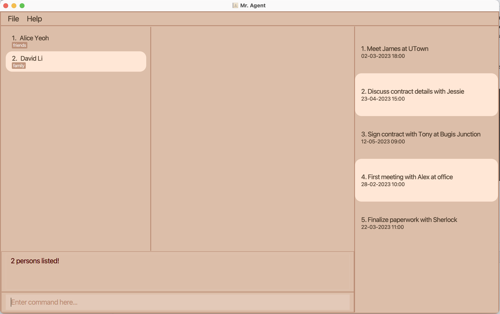

By: Team CS2103-F09-3  (Mo YunBin, Jessica Jacelyn, Koh Su En, Zheng ZiKang)

- [1. Introduction](#Introduction)
- [2. Quick Start](#Quick)
- [3. Features](#features)
  - [3.1. Client Management](#client-management)
    - [Adding a client: `add -c`](#add-client)
    - [Listing all clients : `list -c`](#list-client)
    - [Deleting a client : `delete -c`](#delete-client)
    - [Editing a client: `edit -c`](#edit-client)
    - [Locating client by name: `find -c`](#find-client)
  - [3.2. Insurance](#insurance)
    - [Adding an insurance: `add -i`](#add-insurance)
    - [Listing all insurances : `list -i`](#list-insurance)
    - [Deleting an insurance : `delete -i`](#delete-insurance)
    - [Editing an insurance : `edit -i`](#edit-insurance)
    - [Finding an insurances: `find -i`](#find-insurance)
  - [3.3. Record](#record)
    - [Adding a record: `add -r`](#add-record)  
    - [Deleting a record: `delete -r`](#delete-record)
    - [Listing all records: `list -r`](#list-record)
    - [Editing a record: `edit -r`](#edit-record)
    - [Finding a record by insurance name: `find -r`](#find-record)
    - [Sorting records: `sort -r`](#sort-record)  
  - [3.4. History](#history)
    - [Listing all appointments history: `list -h`](#list-appointmentHistory)
    - [Listing all expired records: `list -e`](#list-expiredRecords)
  - [3.5. Appointment](#appointment)
    - [Adding an appointment: `add -a`](#add-appointment)
    - [Listing all appointments: `list -a`](#list-appointment)
    - [Deleting an appointment: `delete -a`](#delete-appointment)
    - [Editing an appointment: `edit -a`](#edit-appointment)
    - [Locating appointments by keyword: `find -a`](#find-appointment)
    - [Sorting appointments: `sort -a`](#sort-appointment)
    - [Clear appointments: `clear -a`](#clear-appointment)
  - [3.6. Others](#others)
- [4. FAQ](#FAQ)
- [5. Command Summary](#Summary)

--------------------------------------------------------------------------------------------------------------------
## **1. Introduction**

Mr. Agent is a **desktop app for managing contacts, optimized for use via a Command Line Interface** (CLI) while still having the benefits of a Graphical User Interface (GUI). If you can type fast, Mr. Agent can get your contact management tasks done faster than traditional GUI apps.

--------------------------------------------------------------------------------------------------------------------

## **2. Quick start**

1. Ensure you have Java `11` or above installed in your Computer.

1. Download the latest `Mr Agent.jar` from [here](https://github.com/AY2122S2-CS2103-F09-3/tp/releases).

1. Copy the file to the folder you want to use as the _home folder_ for your AddressBook.

1. Double-click the file to start the app. The GUI similar to the below should appear in a few seconds.  Note how the app contains some sample data, so before using the application for yourself, you should type **`clear`** to clear them.  
   
     
1. Type the command in the command box and press Enter to execute it. e.g. typing **`help`** and pressing Enter will open the help window. 
   Some example commands you can try:

   * **`list -c`** : Lists all clients.

   * `add -c n/John Doe p/98765432 e/johnd@example.com a/311, Clementi Ave 2, #02-25 t/friends t/owesMoney` : Adds a client named `John Doe` to Mr. Agent.

   * **`delete`**`-c 3` : Deletes the 3rd client shown in the current list.

   * **`clear`** : Deletes all entry in Mr. Agent (use with caution!).

   * **`exit`** : Exits the app.

1. Refer to the [Features](#features) below for details of each command.

:exclamation:Please do not delete any json file in the generated `data` folder, deletion of a single data file could result in unexpected inconsistencies between data entries in the application.

--------------------------------------------------------------------------------------------------------------------

## **3. Features**

**:information_source: Notes about the command format:** 

* Words in `UPPER_CASE` are the parameters to be supplied by the user. 
  e.g. in `add n/NAME`, `NAME` is a parameter which can be used as `add n/John Doe`.

* Items in square brackets are optional. 
  e.g. `n/NAME [t/TAG]` can be used as `n/John Doe t/friend` or as `n/John Doe`.

* Items with `…`​ after them can be used multiple times including zero times. 
  e.g. `[t/TAG]…​` can be used as ` ` (i.e. 0 times), `t/friend`, `t/friend t/family` etc.

* Parameters can be in any order. 
  e.g. if the command specifies `n/NAME p/PHONE_NUMBER`, `p/PHONE_NUMBER n/NAME` is also acceptable.

* If a parameter is expected only once in the command, but you specified it multiple times, only the last occurrence of the parameter will be taken. 
  e.g. if you specify `p/12341234 p/56785678`, only `p/56785678` will be taken.

* Extraneous parameters for commands that do not take in parameters (such as `help`, `list`, `exit` and `clear`) are not allowed. 

## 3.1. Client Management
### Adding a Client: `add -c`

Adds a client to Mr. Agent.

Note that client name must be unique. The client will be only identified by client name.

Format: `add -c n/NAME p/PHONE_NUMBER e/EMAIL a/ADDRESS [t/TAG]…​`

:bulb: **Tip:**
A client can have any number of tags (including 0)

Examples:
* `add -c n/JunJie p/98765432 e/junjie@example.com a/John street, block 123, #01-01`
* `add -c n/Betsy Crowe t/friend e/betsycrowe@example.com a/Newgate Prison p/1234567 t/NUS`

### Listing all Client : `list -c`

Shows a list of all clients in the Mr. Agent.

Format: `list -c`

### Deleting a Client : `delete -c`

Deletes the specified client from the Mr. Agent.

Format: `delete -c INDEX`

* Deletes the person at the specified `INDEX`.
* The index refers to the index number shown in the displayed person list.
* The index **must be a positive integer** 1, 2, 3, …​
* Note that if a client is deleted, the records belong to this client will be deleted at same time.

Examples:
* `list -c` followed by `delete -c 2` deletes the 2nd person in the Mr. Agent.
* `find -c Junjie` followed by `delete -c 1` deletes the 1st person in the results of the `find` command.

### Editing a Client : `edit -c`

Edits an existing client in the Mr. Agent.

Format: `edit -c INDEX [n/NAME] [p/PHONE] [e/EMAIL] [a/ADDRESS] [t/TAG]…​`

* Edits the client at the specified `INDEX`. The index refers to the index number shown in the displayed person list. The index **must be a positive integer** 1, 2, 3, …​
* At least one of the optional fields must be provided.
* Existing values will be updated to the input values.
* When editing tags, the existing tags of the person will be removed i.e adding of tags is not cumulative.
* You can remove all the person’s tags by typing `t/` without
    specifying any tags after it.

Examples:
*  `edit -c 1 p/91234567 e/johndoe@example.com` Edits the phone number and email address of the 1st person to be `91234567` and `johndoe@example.com` respectively.
*  `edit -c 2 n/Betsy Crower t/` Edits the title of the 2nd person to be `Betsy Crower` and clears all existing tags.

### Locating Clients by Name: `find -c`

Finds client whose name contain any of the given keywords.

Format: `find -c KEYWORD [MORE_KEYWORDS]`

* The search is case-insensitive. e.g `mike` will match `Mike`
* The order of the keywords does not matter. e.g. `Lee Junjie` will match `Junjie Lee`
* Only the name is searched.
* Only full words will be matched e.g. `Le` will not match `Lee`
* Persons matching at least one keyword will be returned (i.e. `OR` search).
  e.g. `Lee Junjie` will return `Wong Junjie`, `Lee Yang`

Examples:
* `find -c John` returns `john` and `John Doe`
* `find -c alice david` returns `Alice Yeoh`, `David Li`  
  

## 3.2. Insurance

### Adding an insurance : `add -i`

Adds a new type of insurance to Mr. Agent.

Format: `add -i  t/TITLE p/PRICE`

* Adds an insurance type as specified in the `TITLE` with its `PRICE`
* The price must be positive decimal number including 0

Examples:
* `add -i t/hosipitalision p/1999`
* `add -i t/terminal_illness p/199.99`

### Listing all insurances : `list -i`

Shows a list of all insurances in Mr. Agent.

Format: `list -i`

### Deleting an insurance : `delete -i`

Deletes the specified insurance from Mr. Agent.

Note that if an insurance is deleted, the records related to this insurance will be deleted. 

Format: `delete -i INDEX`

### Editing an insurance : `edit -i`

Edits an existing insurance in the Mr. Agent.

Format: `edit -i INDEX [t/TITLE] [p/PRICE]`

* Edits the insurance at the specified `INDEX`. The index refers to the index number shown in the displayed insurance list. The index **must be a positive integer** 1, 2, 3, …​
* At least one of the optional fields must be provided.
* Existing values will be updated to the input values.

Examples:
*  `edit -i 1 t/MOTOR INSURANCE V2` Edits the title of the 1st insurance to be `MOTOR INSURANCE V2`.
*  `edit -i 2 p/1999` Edits the price of the 2nd insurance to be `1999`.

### Locating insurances by title : `find -i`

Finds insurances whose title contain any of the given keywords.

Format: `find -i KEYWORD [MORE_KEYWORDS]`

* The search is case-insensitive. e.g `car` will match `Car`.
* The order of the keywords does not matter. e.g. `car home` will match `home car`.
* Only the insurance title is searched.
* Only full words will be matched e.g. `insurance` will not match `reinsurance` 
* Insurances matching at least one keyword will be returned (i.e. OR search). 
e.g. `motor home` will return `Motor Insurance` and `Home Insurance`

## 3.3. Record
### Adding a record : `add -r`

Adds a record to a client.

Format: `add -r c/CLIENT_INDEX i/INSURANCE_INDEX sd/START_DATE ed/END_DATE`

* START_DATE and END_DATE are in the format of dd-MM-yyyy
* Each client can have mutiple same type of insurance but the previous insurance should be expired before adding the new record. For example, if `add -r c/1 i/1 sd/02-01-2021 ed/01-03-2026` exist in app, which means that the insurance type 1 will be expired on 01-03-2026,
  user cannot `add -r c/1 i/1 sd/01-03-2025 ed/01-03-2026` as the `STARTDATE` of this command is before the `ENDDATE` of the previous command.
* Client index and Insurance index starts from 1 
* Note that insurance/client index will be based on a filtered list. 
So you can `find -i`/`find -c` to find insurance/client then add record base on the filtered result.

Examples: 
* `add -r c/10 i/2  sd/23-02-2022 ed/23-02-2024` , adds an insurance 2 to index 10 with start date from 23-02-2022 and end date at 23-02-2024
* `add -r c/25 i/2  sd/21-11-2021 ed/21-11-2023`

### Deleting a record : `delete -r`

Deletes the specified record from Mr. Agent.

Format: `delete -r RECORD_INDEX`

### Listing all records : `list -r`

Shows a list of all unexpired records in Mr. Agent.

Format: `list -r`

### Editing a record : `edit -r` 

Edits an existing record in Mr. Agent.

Format: `edit -r INDEX [c/CLIENT_INDEX] [i/INSURANCE_INDEX] [sd/START_DATE] [ed/END_DATE]`

* Edits the record at the specified `INDEX`. The index refers to the index number shown in the displayed record list. The index **must be a positive integer** 1, 2, 3, …​
* At least one of the optional fields must be provided.
* Existing values will be updated to the input values.

Example:
*  `edit -r 1 c/2 i/2` Edits the client and the type of insurance of the 1st record to be client 2 and insurance 2 respectively.

### Finding records by keyword : `find -r`

Find records whose insurance name contains any of the given keyword.

Format: `find -r KEYWORD [MORE_KEYWORDS]`

* The search is case-insensitive, e.g. `health` will match `Health`
* The order of the keywords does not matter. e.g. `critical illness ` will match `illnes critical`
* Only the insurance name is searched
* Only full words will be matched, e.g. `hea` will not match `health`
* Records matching at least one keyword will be returned (i.e. `OR` search)

Example: 
* `find -r health` 

### Sort records : `sort -r`

Sorts the record list in ascending or descending order by start/end date.

Format: `sort -r SORT_OPTION`
* To sort in ascending order by start date, replace SORT_OPTION with `sa`
* To sort in descending order by start date, replace SORT_OPTION with `sd`
* To sort in ascending order by end date, replace SORT_OPTION with `ea`
* To sort in descending order by end date, replace SORT_OPTION with `ed`

Example:
*  `sort -r sa` Sorts the records list by start date in ascending order.

:information_source:The sort operation will be performed on the record list being displayed at that point of time. To sort the whole record list, issue a `list -r` command to list all the record first.

## 3.4. History

### Listing appointment history : `list -h`

Shows a list of all passed appointments.

Format: `list -h`

### Listing expired records : `list -e`

Shows a list of all expired records.

Format: `list -e`

[//]: # (### List history by client &#40;***coming soon***&#41;)

## 3.5. Appointment

### Adding an appointment : `add -a`

Adds a new appointment with client.

Format: `add -a d/DESCRIPTION dt/DATETIME`

* only present or fututre `DATETIME` is allowed.

Examples:
* `add -a d/Meet James dt/20-02-2022 18:00` 

### Listing all appointments : `list -a`

Lists all ongoing appointments in Mr. Agent.

Format: `list -a`

### Deleting an appointment : `delete -a`

Deletes the specified appointment from Mr. Agent.

Format: `delete -a APPOINTMENT_INDEX`

### Editing an appointment : `edit -a`

Edits an existing appointment.

Format: `edit -a APPOINTMENT_INDEX [d/DESCRIPTION] [dt/DATETIME]` 

### Locating appointments by keyword : `find -a`

Find appointments whose title contains any of the given keyword

Format: `find -a KEYWORD [MORE_KEYWORDS]`

### Sorting appointments : `sort -a`

Sorts the appointment list ascending or descending order by time.

Format: `sort -a SORT_OPTION`
* To sort in ascending order, replace SORT_OPTION with `a`
* To sort in descending order, replace SORT_OPTION with `d`

:information_source:The sort operation will be performed on the appointment list being displayed at that point of time. To sort the whole appointment list, issue a `list -a` command to list all the appointment first.

### Clear appointments : `clear -a`

Clear all appointments (including expired and unexpired ones).

Format: `clear -a`

## 3.6. Others

### Clearing all entries : `clear`

Clears all entries from the Mr. Agent. Use with caution.

Format: `clear`

### Exiting the program : `exit`

Exits the program.

Format: `exit`

--------------------------------------------------------------------------------------------------------------------

## **4. FAQ**

**Q**: How do I transfer my data to another Computer? 
**A**: Install the app in the other computer and overwrite the empty data file it creates with the file that contains the data of your previous Mr. Agent home folder.

--------------------------------------------------------------------------------------------------------------------

## **5. Command Summary**

| Action                                                  | Format, Examples                                                                                                                                                        
|---------------------------------------------------------|-------------------------------------------------------------------------------------------------------------------------------------------------------------------------
| **Add a client**                                        | `add -c n/NAME p/PHONE_NUMBER e/EMAIL a/ADDRESS [t/TAG]…​`   e.g., `add -c n/James Ho p/22224444 e/jamesho@example.com a/123, Clementi Rd, 1234665 t/friend t/colleague`
| **Delete a client**                                     | `delete -c INDEX`  e.g., `delete -c 3`                                                                                                                                  
| **Edit a client**                                       | `edit -c INDEX [n/NAME] [p/PHONE_NUMBER] [e/EMAIL] [a/ADDRESS] [t/TAG]…​`  e.g.,`edit -c 2 n/James Lee e/jameslee@example.com`                                       
| **Find a client**                                       | `find -c KEYWORD [MORE_KEYWORDS]`  e.g., `find -c James Jake`                                                                                                           
| **List all client**                                     | `list -c`                                                                                                                                                               
| **Add an insurance**                                    | `add -i t/TITLE p/PRICE`                                                                                                                                                
| **Delete an insurance**                                 | `delete -i INSURANCE_INDEX`
| **Edit an insurance**                                   | `edit -i INSURANCE_INDEX [t/TITLE] [p/PRICE]`
| **Find insurance(s)**                                   | `find -i KEYWORD [MORE_KEYWORDS]`                                                                                                                                                                                                                                                                                |
| **List all insurance**                                  | `list -i`                                                                                                                                                               
| **Add an appointment**                                  | `add -a d/DESCRIPTION dt/DATETIME`                                                                                                                                      
| **Delete an appointment**                               | `delete -a APPOINTMENT_INDEX`
| **Edit an appointment**                                 | `edit -a APPOINTMENT_INDEX [d/DESCRIPTION] [dt/DATETIME]`
| **Find appointment(s)**                                 | `find -a KEYWORD [MORE_KEYWORDS]`
| **List all appointments**                               | `list -a`                                                                                                                                                               
| **Sort appointments in ascending order by time**        | `sort -a a`                                                                                                                                                             
| **Sort appointments in descending order by time**       | `sort -a d`  
| **Clear all appointments**                              | `clear -a` 
| **Add a record**                                        | `add -r c/CLIENT_INDEX i/INSURANCE_INDEX sd/START_DATE ed/END_DATE`                                                                                                     
| **Delete a record**                                     | `delete -r RECORD_INDEX`                                                                                                                                                
| **Edit a record**                                       | `edit -r INDEX [c/CLIENT_INDEX] [i/INSURANCE_INDEX] [sd/START_DATE] [ed/END_DATE]`   e.g.,`edit -r 1 c/5`
| **Find record(s)**                                      | `find -r KEYWORD [MORE_KEYWORDS]`
| **List all record**                                     | `list -r`                                                                                                                                                              
| **Sort record in ascending order by start/end date**    | `sort -r sa`/ `sort -r ea`                                                                                                                                              
| **Sort record in descending order by start/end date**   | `sort -r sd`/ `sort -r ed`                                                                                                                                              
| **List appointment history**                            | `list -h`                                                                                                                                                               
| **List expired records**                                | `list -e`                                                                                                                                                               

